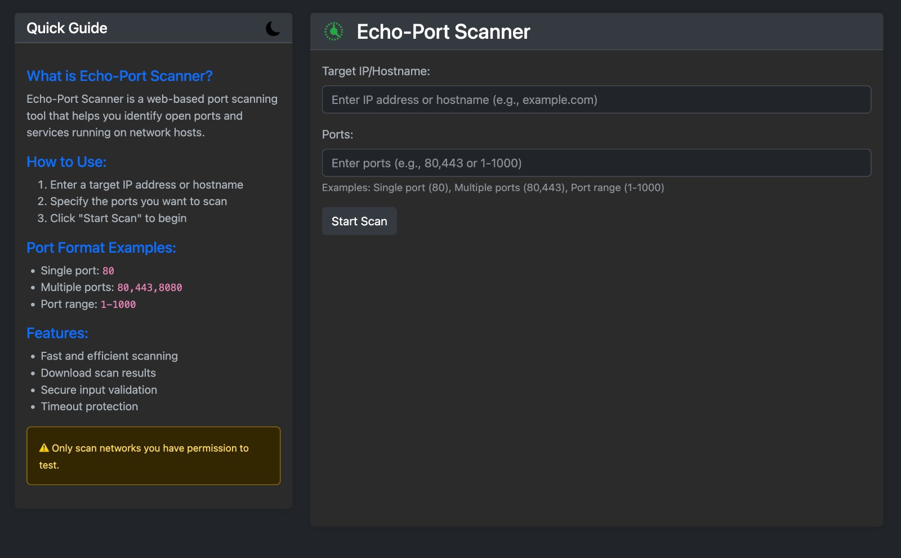

# Echo-Port Scanner

[](https://opensource.org/licenses/MIT)
[](https://www.docker.com/)
[](https://flask.palletsprojects.com/)
[](https://kubernetes.io/)

A modern web-based port scanning tool built with Flask and Docker. Echo-Port Scanner provides an intuitive interface for network port scanning with support for multiple output formats and dark mode.




## Project Structure
```
echo-port-scanner/
├── .github/
│   └── workflows/
│       └── docker-build.yml      # GitHub Actions workflow
├── static/
│   ├── favicon.svg              # Application favicon
│   ├── theme-dark.svg          # Dark theme icon
│   └── theme-light.svg         # Light theme icon
├── templates/
│   ├── index.html              # Main scanning page
│   └── result.html             # Scan results page
├── .gitignore                  # Git ignore rules
├── app.py                      # Main Flask application
├── deploy.sh                   # Deployment script
├── docker-compose.yml          # Docker Compose configuration
├── Dockerfile                  # Docker build instructions
├── LICENSE                     # MIT License
├── README.md                   # This file
└── requirements.txt            # Python dependencies
```

## Features

- 🌐 Web-based interface for Nmap scanning
- 🎯 Support for multiple target formats:
  - Single IP/hostname
  - IP ranges (192.168.1.1-254)
  - Multiple targets (comma-separated)
- 📊 Multiple export formats:
  - LOG (default)
  - JSON
  - CSV
- 🌙 Dark/Light mode support
- 📱 Responsive design
- 🔒 Input validation and sanitization
- 🐳 Docker support
- ⚡ Real-time scan results
- 📈 Scan statistics and metrics

## Quick Start

### Using Docker Compose (Recommended)
```bash
git clone https://github.com/sk3pp3r/echo-port-scanner.git
cd echo-port-scanner
# Deploy using the script
chmod +x deploy.sh
./deploy.sh
```

### Or manually
`docker-compose up -d`

The application will be available at `http://localhost:8085`

### Manual Installation

## Security Considerations

- The application runs with minimal container privileges
- Input validation for all user inputs
- No root access in container
- Network access limited to scanning capabilities

## Contributing

Contributions are welcome! Please feel free to submit a Pull Request.

1. Fork the repository
2. Create your feature branch (`git checkout -b feature/AmazingFeature`)
3. Commit your changes (`git commit -m 'Add some AmazingFeature'`)
4. Push to the branch (`git push origin feature/AmazingFeature`)
5. Open a Pull Request

## License

This project is licensed under the MIT License - see the [LICENSE](LICENSE) file for details.

## Author

**Haim Cohen**
- LinkedIn: [@haimc](https://www.linkedin.com/in/haimc/)
- GitHub: [@sk3pp3r](https://github.com/sk3pp3r)

## Acknowledgments

- [Nmap](https://nmap.org/) for the powerful network scanning capabilities
- [Flask](https://flask.palletsprojects.com/) for the web framework
- [Bootstrap](https://getbootstrap.com/) for the UI components

## Disclaimer

This tool is for educational and authorized testing purposes only. Unauthorized scanning may be illegal. Use responsibly and only on networks you own or have permission to test.
