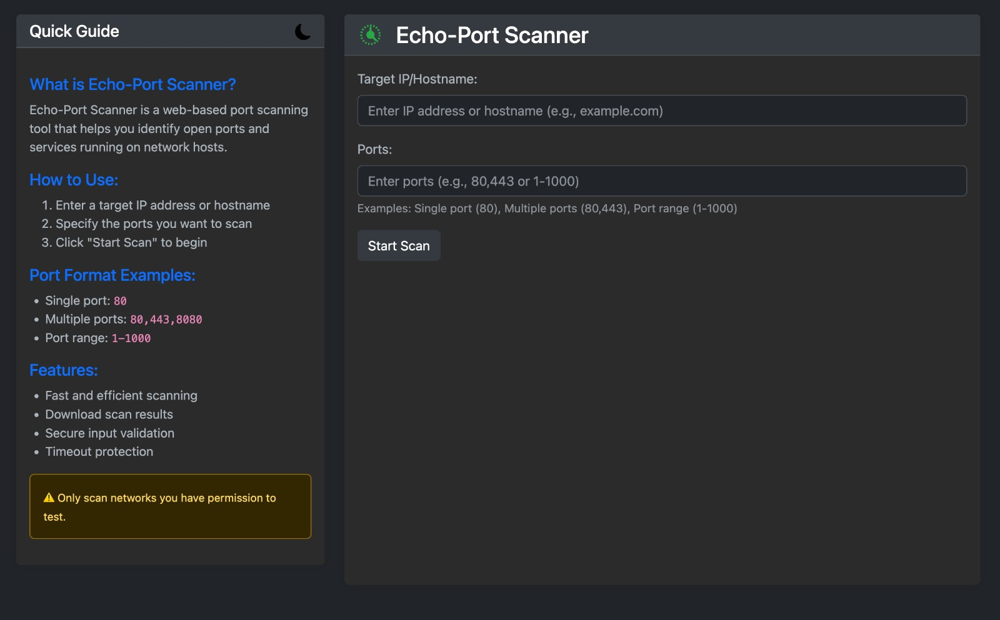
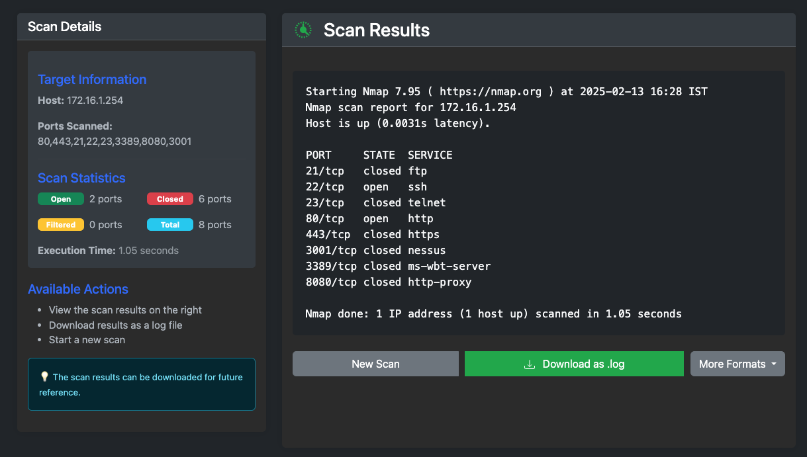

# Echo-Port Scanner Screenshots

## Main Interface

*The main scanning interfacet*

## Dark Mode

*The main scanning interface with dark mode support*

## Scan Results

*Detailed scan results with statistics and export options*

## Scan multiple hosts with port range

*multiple hosts with port range*

## Results of scan multiple hosts with port range

*results - multiple hosts with port range*

## Target Information

*Target Information*

## Json log

*json log output*

## CSV log

*csv log output*

---
Note: These screenshots are for demonstration purposes. Your actual interface may vary slightly depending on the version and configuration. 
